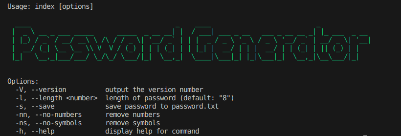

## Installation

1. Clone the repository:

   ```
   git clone https://github.com/iam-abin/password-gen-cli.git
   ```

2. Navigate to the project directory:

   ```
   cd password-gen-cli
   ```

3. Install the dependencies ;

   ```
   npm install 
   ```

4. To generate a random password

   ```
   node index.js
   ```

## To see all other available options 

```
node index -h
```


options eg:-
To generate password of length 13, we can use as

```
node index -l 13
```
